# Election_Analysis

## Overview of Project

**Purpose:**  
A Colorado Board of Elections employee, Tom, is asking for assistance in completing an election audit for a recent local congressional election. For this analysis, we would need to compile a list of candidates, votes for each candidate, precent of votes for each candidate, and providing the final results to determine the winner of the election. Although we completed our initial audit, the election commission requested additional data related county turnouts, voter turnouts for each county, percentage of votes for each county, and the highest county turnout. The purpose of this analysis is to assist Tom with analyzing and calculating the data to determine the winner of the election based on popular vote, as well as data calculating data for county turnouts and determining the highest county turnout.

## Resources:
- Data Source: election_results.csv
- Software: Python 3.10.0, Visual Studio Code, 1.62.3

## Analysis and Results

**Analysis:**  
For this analysis, we were provided with a set of data, election_results.csv, which had information on voter ID, voter county, and the candidate that the voter was voting for. With the data set, the candidate that the voter was voting the county of where the voter was voting from were the important data that we need to extract and use for our analysis. Using a simple `for loop` in Python, we are able to calculate total number of votes by calculating the number of rows in our dataset, omitting the header row from our count. Within the `for loop` we used an `if statement` to determine the candidates and added them into a list. From there, we used the same `for loop` to sort all of the votes by candidates to determine number of votes for each candidate. Once we have the number of votes per candidate as well as the total number of votes for the election, we can calculate the percentage of votes for each candidate and determine the winner based on the total number of votes and the percent of votes for each candidate. The winner would have both the highest total number of votes and the highest percentage of votes.  
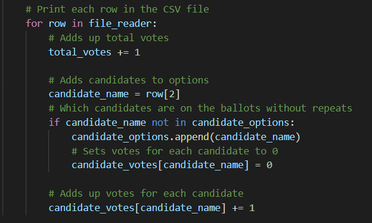  
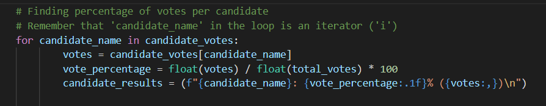  
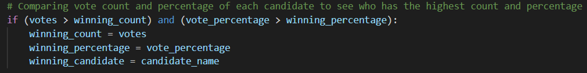  

We used similar formulas to perform our analysis and calculating the county data that was also required by the election commission, voter turnout for each county, percentage of voters for each county, and the largest county turnout.  
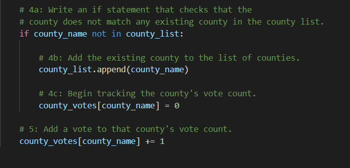  
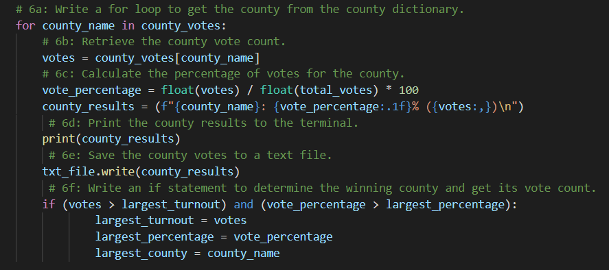  

**Results:**  
- How many votes were cast in this congressional election?  
A total of 369,711 votes that were cast during this congressional election

- Breakdown of the number of votes and percentage of total votes for each county in the precinct.  
There were three different counties that participated in this congressional election, Jefferson, Denver, and Arapahoe. Jefferson had 10.5% (or 38,855) of the votes, while Denver and Arapahoe had 82.8% (306,055) and 6.7% (24,801), respectively, of the votes.

- Which county had the largest number of votes?  
Denver had the largest number of votes, 306,055 votes, which is 82.8% of the total votes.

- Breakdown of the number of votes and percentage of total votes for each candidate.  
Three different candidates ran for office in this election, Charles Casper Stockham, Diana DeGette, and Raymon Anthony Doane. Stockham recieved 23.0% of votes, which consisted of 85,213 of the total votes, while DeGette and Doane recieved 73.8% (272,892) and 3.1% (11,606) of votes, respectively.

- Which candidate won the election?  
The winner of this election was Diana DeGette with a total of 272,892 votes, which was 73.8% of the total number of votes.  
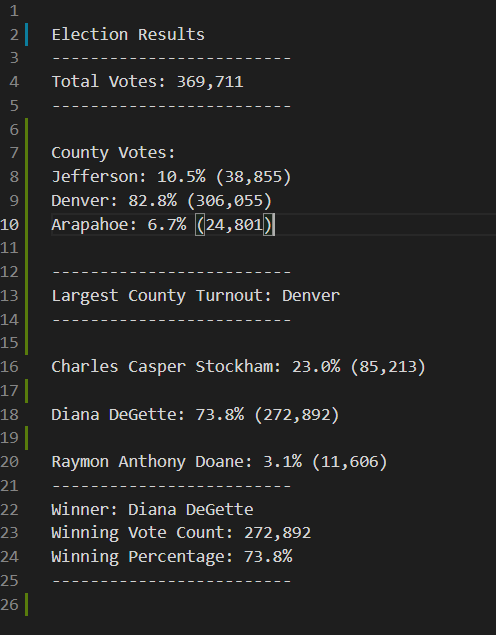  

## Challenge Overview
## Challenge Summary

- Advantages and Disadvantages of refactoring code (in general)  
In a sense, why fix what's not broken? An advantage of refactoring code is that it will run faster, as noted in the images above on time elasped for the scripts. Another advantage to refactoring code is to clean up the design of the code, so it would be easier to maintain and read for future users. One disadvantage of refactoring code is that requires time to edit and clean up the code so that it would be easier to use. Another disadvantage that I personally encountered was that I was getting bugs and had to debug the errors that occurred when refactoring the code, which was time consuming and had to take up other resources to solve and fix the problem.

- Advantages and Disadvantages of the original and refactored VBA script  
An advantage of the refactored VBA script, was that it ran faster compared to the origial script, so I guess that would also be a disadvantage of the original code. A disadvantage of the refactored script would be that bugs could occur when changing or modifying the code. I personally was getting bugs and took a while for me to identify and fix the errors that occurred, which took time and resources. In terms of understanding how the code works, this would allow the user to understand how or why the refactored code/script would run faster and efficiently.

### Codes Used  
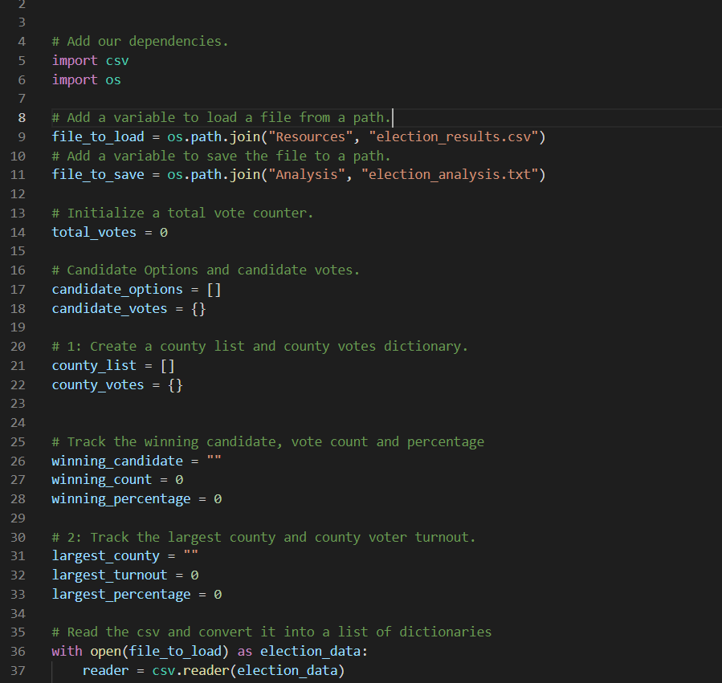
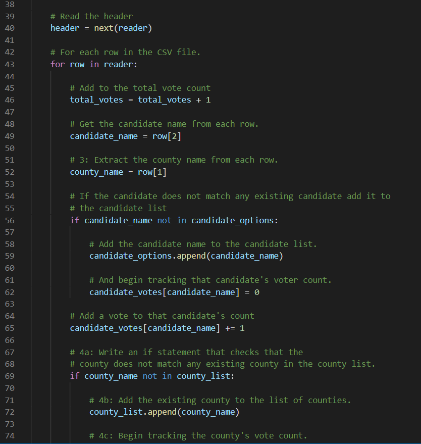
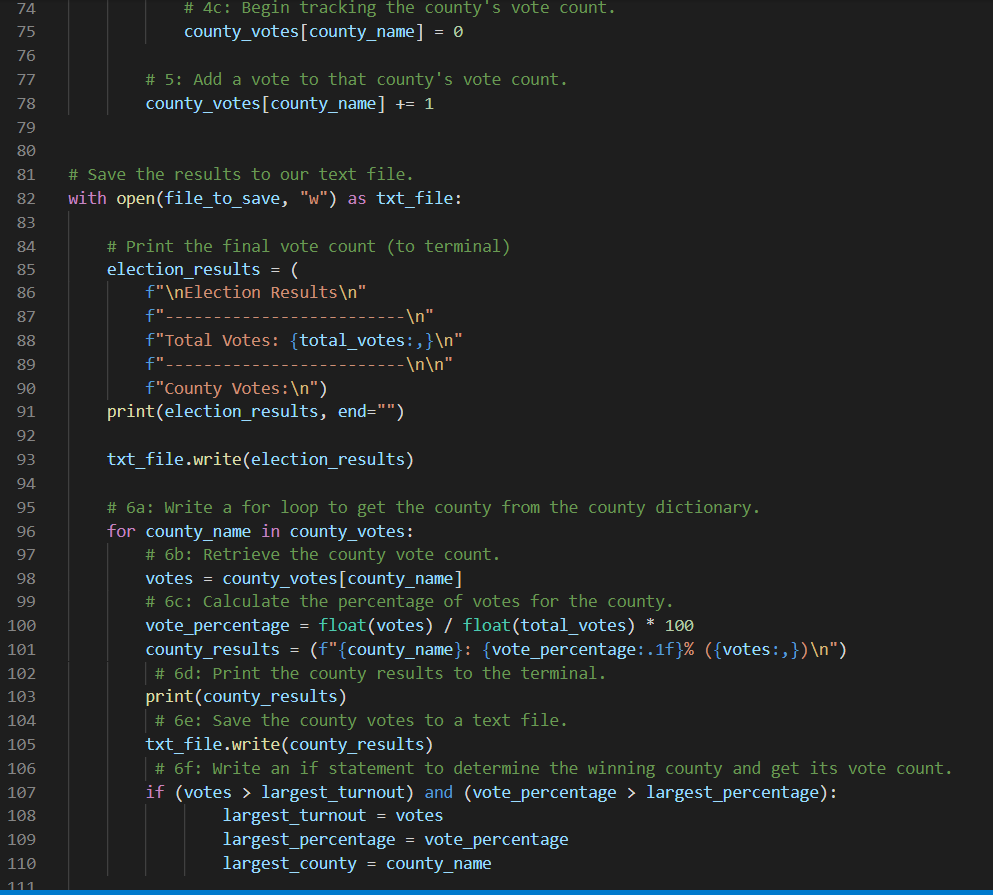
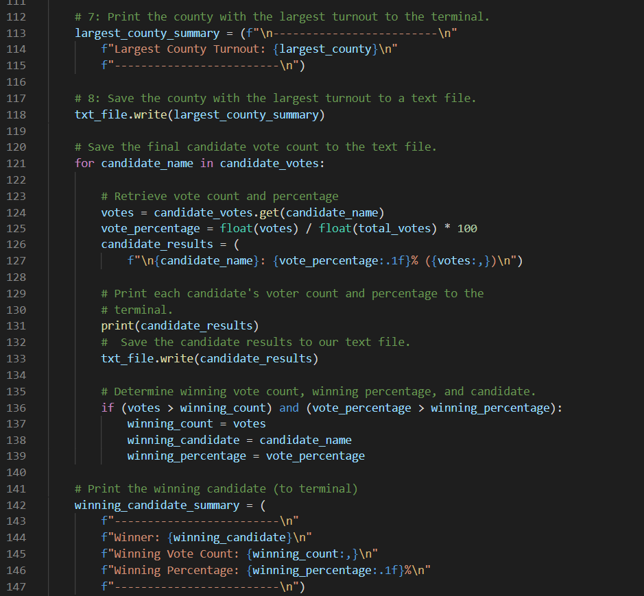
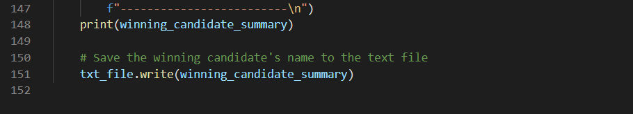