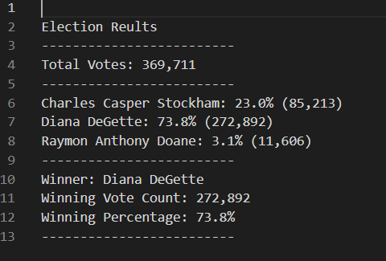
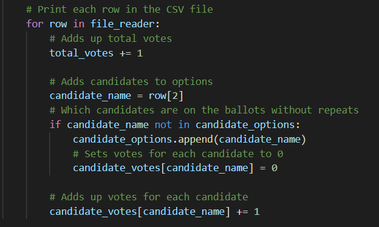
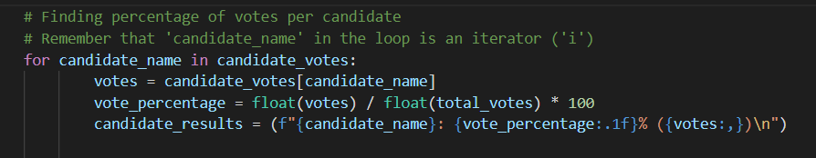

# Election_Analysis

## Overview of Project

**Purpose:**  
A Colorado Board of Elections employee, Tom, is asking for assistance in completing an election audit for a recent local congressional election. For this analysis, we would need to compile a list of candidates, votes for each candidate, precent of votes for each candidate, and providing the final results to determine the winner of the election. The purpose of this analysis is to assist Tom with analyzing and calculating the data to determine the winner of the election based on popular vote. 

## Resources:
- Data Source: election_results.csv
- Software: Python 3.10.0, Visual Studio Code, 1.62.3

## Analysis and Results

**Analysis:**  
For this analysis, we were provided with a set of data, election_results.csv, which had information on voter ID, voter county, and the candidate that the voter was voting for. With the data set, the candidate that the voter was voting for is the most important data that we need to extract and use for our analysis, as our goal was to calculate votes, percentage of votes, and determininng the winner based on popular vote. Using a simple `for loop`, we are able to calculate total number of votes. Within the `for loop` we used an `if statement` to determine the candidates and added them into a list. From there, we were again able to use the same `for loop` to sort and count the number of votes for each candidate. Once we have the total number of votes per candidate as well as the total number of votes for the election, we can calculate the percentage of votes for each candidate and determine the winner based on the total number of votes, as well as the percent of votes, for a particular candidate. The winner would have both the highest total number of votes and the percentage of votes.

**Results:**  
Tallying up all of the votes for all of the candidates in this election, we counted a total of 369,711 votes. Next, we sorted the votes by candidates and was able to calculate the percentage of the votes for each candidate. From there, it was easy to see a clear winner of this election based on popular vote, Diana DeGetter with 272,892 votes which is 73.8% of all votes.  
  

## Challenge Overview
## Challenge Summary

- Advantages and Disadvantages of refactoring code (in general)  
In a sense, why fix what's not broken? An advantage of refactoring code is that it will run faster, as noted in the images above on time elasped for the scripts. Another advantage to refactoring code is to clean up the design of the code, so it would be easier to maintain and read for future users. One disadvantage of refactoring code is that requires time to edit and clean up the code so that it would be easier to use. Another disadvantage that I personally encountered was that I was getting bugs and had to debug the errors that occurred when refactoring the code, which was time consuming and had to take up other resources to solve and fix the problem.

- Advantages and Disadvantages of the original and refactored VBA script  
An advantage of the refactored VBA script, was that it ran faster compared to the origial script, so I guess that would also be a disadvantage of the original code. A disadvantage of the refactored script would be that bugs could occur when changing or modifying the code. I personally was getting bugs and took a while for me to identify and fix the errors that occurred, which took time and resources. In terms of understanding how the code works, this would allow the user to understand how or why the refactored code/script would run faster and efficiently.

### Codes Used
  
  
  
