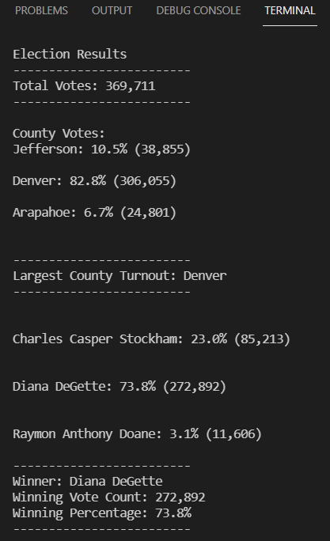

# Election_Analysis

## Overview of Project

**Purpose:**  
A Colorado Board of Elections employee, Tom, is asking for assistance in completing an election audit for a recent local congressional election. For this analysis, we would need to compile a list of candidates, votes for each candidate, precent of votes for each candidate, and providing the final results to determine the winner of the election. Although we completed our initial audit, the election commission requested additional data related county turnouts, voter turnout for each county, percentage of votes for each county, and the highest county turnout. The purpose of this analysis is to assist Tom with analyzing and calculating the data to determine the winner of the election based on popular vote, as well as calculating data for county turnouts and determining the highest county turnout.

## Resources:
- Data Source: election_results.csv
- Software: Python 3.10.0, Visual Studio Code, 1.62.3

## Analysis and Results

**Analysis:**  
For this analysis, we were provided with a dataset, election_results.csv, which had information on voter ID, voter county, and the candidate that the voter was voting for. With the dataset, the candidate that the voter was voting for and the county of where the voter was voting from are the important data values that we need to extract and use for our analysis. Using a simple `for loop` in Python, we are able to calculate total number of votes by calculating the number of rows in our dataset, omitting the header row from our count. Within the `for loop` we used an `if statement` to determine the candidates and added them into a list. From there, we used the same `for loop` to sort all of the votes by candidates to determine number of votes for each candidate. Once we have the number of votes per candidate as well as the total number of votes for the election, we can calculate the percentage of votes for each candidate and determine the winner based on the total number of votes and the percent of votes for each candidate. The winner would have both the highest total number of votes and the highest percentage of votes.  
  
  
  

We used similar formulas to perform our analysis and calculating the county data that was also required by the election commission, voter turnout for each county, percentage of voters for each county, and the largest county turnout.  
  
  

**Results:**  
- How many votes were cast in this congressional election?  
A total of 369,711 votes were cast during this congressional election

- Breakdown of the number of votes and percentage of total votes for each county in the precinct.  
There were three different counties that participated in this congressional election, Jefferson, Denver, and Arapahoe. Jefferson had 10.5% (or 38,855) of the votes, while Denver and Arapahoe had 82.8% (306,055) and 6.7% (24,801), respectively, of the votes.

- Which county had the largest number of votes?  
Denver had the largest number of votes, 306,055, which is 82.8% of the total votes.

- Breakdown of the number of votes and percentage of total votes for each candidate.  
Three different candidates ran for office in this election, Charles Casper Stockham, Diana DeGette, and Raymon Anthony Doane. Stockham recieved 23.0% of votes, which consisted of 85,213 votes, while DeGette and Doane recieved 73.8% (272,892) and 3.1% (11,606) of votes, respectively.

- Which candidate won the election?  
The winner of this election was Diana DeGette with a total of 272,892 votes, which was 73.8% of the total number of votes.  
  

## Challenge Summary

**Summary**  
We used Python to write scripts and codes to assist with tallying up votes for each candidate and votes from different counties. We also were able to calculate percentage of votes for each candidate and percentage of votes from different counties. From there, we were able to determine a winner for the election based on popular votes when looking at total number of votes and highest percentage of votes for each candidate. As well as calculating the largest county turnout. This script can be used not only for this election, but also for future elections as well. Using a dataset from a different election, or even a future election, we can use the same script to calculate similar data values for both votes per different candidates and for the voter turnouts for different counties. If a candidate were wanting to campaign in certain counties, for example, we can modify the script to give use votes or percentage of votes from specific counties per candidate. This may give us a better idea of where candidates may want to campaign more in those areas to increase their vote count. Another modification we can change in the script is to help use determine how many voters are actually voting when compared to a census on how many people are living in those counties. Some people may not be voting for different reasons, but would be beneficial to understand why and to assist them in participating in the voting process, if desired.

### Codes Used  
  
  
  
  
  